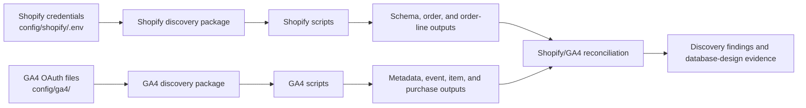

# Product Intelligence Discovery

This repository contains small Python tools and saved evidence used to discover,
test, and document data available from Shopify and Google Analytics 4 (GA4) for
the Steele Product Intelligence project.

> [!IMPORTANT]
> **This is a discovery-only repository.** It is intended for Product
> Intelligence research, API exploration, schema inspection, data-quality
> testing, and reconciliation. It is not the production Product Intelligence
> application, ingestion service, database, dashboard, or analytics platform.
> Under the current plan, all implementation after discovery will happen in
> other repositories. That plan may change later, but until it does, do not add
> production application code, database migrations, scheduled jobs, dashboard
> code, or deployment infrastructure here.

## Contents

- [Why this project exists](#why-this-project-exists)
- [Repository purpose and boundaries](#repository-purpose-and-boundaries)
- [Current state](#current-state)
- [How the discovery works](#how-the-discovery-works)
- [Setup](#setup)
- [Running the scripts](#running-the-scripts)
- [Project structure and file responsibilities](#project-structure-and-file-responsibilities)
- [Verified findings](#verified-findings)
- [Known limitations and open questions](#known-limitations-and-open-questions)
- [Recommended next discovery work](#recommended-next-discovery-work)
- [Keeping this README current](#keeping-this-readme-current)
- [Guidance for AI assistants](#guidance-for-ai-assistants)

## Why this project exists

The planned Product Intelligence Platform is intended to combine commercial and
behavioural data that currently lives in separate systems:

- **Shopify** explains what was ordered and what later happened commercially:
  products, variants, orders, quantities, discounts, shipping, tax, refunds,
  returns, cancellations, and current order state.
- **GA4** explains how people reached and used the website: traffic,
  engagement, product views, add-to-cart behaviour, checkout activity, searches,
  attribution, and captured purchase events.
- **Meta Ads** is expected to explain paid campaign, ad, creative, spend, and
  marketing-efficiency performance.

Looking at these sources separately makes it difficult to answer questions such
as:

- Which products attract attention but do not convert?
- Which products are selling efficiently and may need more inventory?
- Which campaigns and creatives produce valuable behaviour or purchases?
- Where does the customer funnel lose people?
- Which commercial totals are trustworthy, and why do platforms disagree?

The broader product plan is to create a governed database and dashboard layer
that combines these sources while keeping metric definitions, source lineage,
time zones, currency, and data-quality caveats explicit.

### Planned product phases

1. **Database and dashboard foundation:** reliable source ingestion, a
   reasonably normalized database, daily rollups, reconciliation, source-health
   monitoring, and leadership-ready dashboards.
2. **Focused vision-model experiment:** test whether product and creative images
   can provide useful design or e-commerce signals.
3. **Natural-language query interface:** allow users to ask questions against
   governed metrics and receive traceable answers or dashboard views.
4. **Automated insight and mature vision layers:** anomaly detection,
   forecasting, opportunity flags, and reviewed product/creative intelligence.

These are product goals, not features implemented in this repository.

## Repository purpose and boundaries

The job of this repository is to reduce uncertainty before production design
and implementation begin elsewhere.

### In scope here

- Confirm that authorized Shopify and GA4 access works.
- Explore available API objects, fields, dimensions, and metrics.
- Run small, readable reports against selected test windows.
- Save privacy-minimal outputs that can be inspected later.
- Compare Shopify orders with GA4 purchase events and item rows.
- Identify reliable cross-source identifiers and mismatched definitions.
- Record verified findings, likely explanations, limitations, and open
  questions for database and dashboard design.

### Out of scope here

- A production database or canonical warehouse.
- Recurring or scheduled ingestion.
- Production credential and secret management.
- A backend API, user authentication, or role management.
- Frontend dashboards or saved dashboard views.
- Meta Ads ingestion.
- Production monitoring, retry orchestration, deployment, or CI/CD.
- Chatbot, ML, or vision-model production features.

Under the current plan, those capabilities belong in separate repositories
created for the production system. Do not turn the scripts here into a
production framework. Discovery scripts should remain small, explicit, and easy
for a beginner to read and change.

## Current state

**Started:** 20 June 2026  
**Current phase:** Foundation, data discovery, and source reconciliation  
**Sources currently explored:** Shopify Admin GraphQL API and GA4 Admin/Data APIs  
**Sources not yet implemented:** Meta Ads and other possible future sources

The repository currently provides:

- Shared Shopify configuration and GraphQL request handling.
- Shopify connection testing and GraphQL type-field discovery.
- A fixed-window, paginated Shopify order and order-line export.
- Shared GA4 OAuth authentication and token refresh.
- GA4 account/property listing, metadata inspection, event counts, item
  performance, purchase events, and purchase-item reports.
- Saved Shopify and GA4 outputs for inspection.
- A fixed-window Shopify-to-GA4 purchase reconciliation.
- A detailed GA4 discovery report in Markdown and DOCX form.

The most mature work is the Shopify/GA4 investigation for 1-7 July 2026. It
established strong identifier mappings and exposed a GA4 purchase-coverage gap
for the selected window. It did not finish the complete GA4 discovery required
for production database design.

## How the discovery works



The code is intentionally divided into two layers:

1. **Shared packages** contain authentication, configuration, reusable API
   clients, and shared queries.
2. **Scripts** ask one specific discovery question, print or export the result,
   and remain easy to inspect.

The generated outputs are evidence, not production tables. Some were created by
redirecting terminal output to text files; others are CSV or XLSX exports. Their
date window, report grain, filters, and source definitions must be considered
before using their numbers.

## Setup

### Prerequisites

- [`uv`](https://docs.astral.sh/uv/getting-started/installation/)
- Authorized Shopify Admin API credentials
- An authorized Google OAuth Desktop client with GA4 access

The project pins Python 3.12 in `.python-version`. Direct dependencies are
declared in `pyproject.toml`, and exact resolved versions are recorded in
`uv.lock`.

From the project root:

```bash
uv sync
```

This installs the required Python version when needed, creates or updates the
project-local `.venv`, and installs the locked dependencies. You do not need to
activate the environment when using `uv run`.

If an editor asks for an interpreter, select:

```text
./.venv/bin/python
```

Do not use a global, Homebrew, or pyenv interpreter for this checkout.

### Shopify configuration

Create `config/shopify/.env`:

```dotenv
SHOPIFY_SHOP_DOMAIN=your-store.myshopify.com
SHOPIFY_ADMIN_ACCESS_TOKEN=your-access-token
SHOPIFY_API_VERSION=2026-04
```

`SHOPIFY_API_VERSION` is optional and defaults to `2026-04`.

### GA4 configuration

Place the downloaded Google OAuth Desktop client file at:

```text
config/ga4/ga4_oauth_client.json
```

The first authenticated GA4 command opens a browser sign-in flow. After a
successful sign-in, credentials are saved to:

```text
config/ga4/ga4_token.json
```

The token is refreshed automatically when possible. The current OAuth scope is
read-only Analytics access.

All three credential files are ignored by Git. Never commit or paste their
contents into documentation, issues, prompts, or logs.

## Running the scripts

> [!CAUTION]
> These commands contact live Shopify or Google APIs. Use them only with
> authorization. Several reports also contain hard-coded property IDs or date
> ranges. Inspect the relevant script before running it for a new investigation.

### Shopify

Test credentials and print basic shop information:

```bash
uv run python -m scripts.shopify.test_shopify_connection
```

Inspect a Shopify GraphQL type and export its fields:

```bash
uv run python -m scripts.shopify.discover_shopify_type_fields Product
uv run python -m scripts.shopify.discover_shopify_type_fields ProductVariant
uv run python -m scripts.shopify.discover_shopify_type_fields Order
```

The script's default output directory is `outputs/schema_fields/`. The schema
inventories retained in this repository were deliberately generated in
`outputs/shopify_schema_fields/`:

```bash
uv run python -m scripts.shopify.discover_shopify_type_fields Product \
  --output-dir outputs/shopify_schema_fields
```

Export and reconcile the fixed 1-7 July 2026 order window:

```bash
uv run python -m scripts.shopify.export_shopify_orders
```

Before running that command, understand that it:

- uses hard-coded UTC boundaries corresponding to Melbourne-local dates;
- fetches all matching orders and paginates both orders and line items;
- writes fixed filenames under `outputs/shopify_orders/` and
  `outputs/discovery/`;
- reads transaction IDs from two existing GA4 text outputs;
- overwrites the matching output files when rerun.

It is a reproducible discovery experiment, not a general-purpose exporter.

### GA4

Test or establish OAuth authentication:

```bash
uv run python -m scripts.ga4.test_ga4_connection
```

List accessible accounts and properties:

```bash
uv run python -m scripts.ga4.list_ga4_properties
```

Inspect the dimensions and metrics exposed for the selected property:

```bash
uv run python -m scripts.ga4.list_ga4_metadata
```

Run the exploratory reports:

```bash
uv run python -m scripts.ga4.list_ga4_event_counts
uv run python -m scripts.ga4.list_ga4_item_performance
uv run python -m scripts.ga4.list_ga4_purchase_transactions
uv run python -m scripts.ga4.list_ga4_purchase_events
```

Current GA4 script behavior:

- The Data API scripts target property `268350484`.
- Event counts and item performance use a moving `7daysAgo` through `today`
  window, which is inclusive and changes every day.
- Item performance is ordered by views and deliberately limited to 50 rows; it
  is not a complete product extract.
- Purchase transaction and purchase event scripts use the fixed inclusive
  window 1-7 July 2026.
- The scripts print reports to standard output. Saved text files in `outputs/`
  were created from earlier runs and are not automatically refreshed.

### Dependency management

```bash
# Add a direct runtime dependency and update the lockfile/environment
uv add package-name

# Remove a dependency
uv remove package-name

# Update locked dependencies within declared constraints
uv lock --upgrade

# Reproduce the lockfile exactly after pulling changes
uv sync --frozen
```

`pyproject.toml` is the source of truth for direct dependencies. Commit both
`pyproject.toml` and `uv.lock` whenever dependencies change.

## Project structure and file responsibilities

```text
product-intelligence-discovery/
├── shopify_discovery/       Shared Shopify configuration, client, and queries
├── ga4_discovery/           Shared GA4 OAuth authentication
├── scripts/
│   ├── shopify/             Runnable Shopify discovery experiments
│   └── ga4/                 Runnable GA4 discovery experiments
├── config/                  Local ignored credentials and tracked placeholders
├── outputs/                 Saved discovery evidence and generated exports
├── docs/                    Product brief and detailed GA4 discovery reports
├── .python-version          Python version selected by uv
├── pyproject.toml           Project metadata and direct dependencies
├── uv.lock                  Exact resolved dependency versions
└── README.md                Authoritative repository context and instructions
```

### `shopify_discovery/`

- `config.py` defines the immutable `ShopifyConfig` dataclass and
  `load_shopify_config()`. It loads `config/shopify/.env`, validates the shop
  domain and access token, and supplies the default API version.
- `shopify_client.py` defines `ShopifyClient` and `ShopifyApiError`. The client
  builds the Admin GraphQL endpoint, sends authenticated requests with a
  30-second timeout, and raises clear HTTP- or GraphQL-level errors.
- `queries.py` contains the basic shop-information query and a GraphQL
  introspection query that follows nested type wrappers deeply enough to format
  fields and arguments.
- `__init__.py` marks the directory as an importable Python package.

### `ga4_discovery/`

- `auth.py` is the one shared GA4 authentication path. It loads an existing
  token, refreshes it when possible, or starts a local browser OAuth flow and
  saves the resulting token. Discovery scripts should reuse this helper rather
  than duplicate authentication.
- `__init__.py` marks the directory as an importable Python package.

### `scripts/shopify/`

- `test_shopify_connection.py` loads the shared configuration/client, runs the
  basic shop query, and prints identifying shop information.
- `discover_shopify_type_fields.py` accepts a GraphQL type name, converts nested
  GraphQL type references into readable signatures, and writes field names,
  types, required flags, descriptions, and arguments to CSV.
- `export_shopify_orders.py` fetches a fixed Melbourne-local order population,
  paginates orders and line items, flattens money and timestamp fields, writes
  privacy-minimal order/order-line CSVs, reads saved GA4 transaction IDs, and
  classifies each Shopify order by whether GA4 event and item evidence exists.
- `__init__.py` enables module-style execution.

### `scripts/ga4/`

- `test_ga4_connection.py` obtains credentials and confirms authentication.
- `list_ga4_properties.py` uses the GA4 Admin API to print accessible account
  and property summaries.
- `list_ga4_metadata.py` uses the GA4 Data API to print every available
  dimension and metric for the selected property.
- `list_ga4_event_counts.py` prints event names and counts for a moving window.
- `list_ga4_item_performance.py` prints the top 50 item/variant rows by views,
  with view, add-to-cart, purchase, and item-revenue metrics.
- `list_ga4_purchase_transactions.py` prints fixed-window purchase-item rows
  containing dates, transaction IDs, product/variant identifiers, quantities,
  and item revenue.
- `list_ga4_purchase_events.py` prints fixed-window transaction-level purchase
  rows, totals, row counts, time zone, thresholding, data-loss, and sampling
  metadata when available.
- `__init__.py` enables module-style execution.

### `config/`

- `config/shopify/.env` stores local Shopify credentials.
- `config/ga4/ga4_oauth_client.json` stores the Google OAuth client definition.
- `config/ga4/ga4_token.json` stores the local authorized-user token.
- `.gitkeep` files retain otherwise-empty configuration directories without
  committing credentials.

### `outputs/`

- `shopify_schema_fields/` contains 12 saved Shopify GraphQL type inventories,
  including Product, ProductVariant, Order, LineItem, Refund, collection,
  inventory, media, and option-related objects.
- `GA4_metadata/` contains saved metadata, item-performance, purchase-item, and
  purchase-event text reports. The historical filename
  `item_performace.txt` intentionally retains its original misspelling.
- `shopify_orders/` contains fixed-window order and order-line CSV exports.
- `discovery/` contains the fixed order-level reconciliation CSV and an earlier
  ShopifyQL-versus-GA4 reconciliation workbook.

Outputs are evidence tied to their original execution conditions. Do not assume
they are current, exhaustive, or automatically reproducible without checking
the source script and credentials.

### `docs/`

- `Steele Intel - Product Brief and Dev Roadmap.docx` describes the broader
  product vision, users, phased roadmap, candidate architecture, requirements,
  risks, and candidate data model.
- `ga4_discovery_current_state.md` is the detailed, evidence-classified GA4
  research report and the best source for exact findings, caveats, and next
  investigations.
- `GA4_Discovery_Current_State.docx` is an editable document version of the same
  GA4 report.

## Verified findings

The statements below describe repository evidence available as of 21 July
2026. They are discovery findings, not permanent production guarantees.

### Access and useful data

- Shopify Admin GraphQL access works through the shared client.
- GA4 OAuth read-only access works, including saved-token refresh.
- GA4 property `268350484` returns populated Steele ecommerce data.
- Tested GA4 data includes product/variant identifiers, item views,
  add-to-cart quantities, purchase quantities, item revenue, transaction IDs,
  ecommerce purchases, and purchase revenue.

### Product and variant identity

In the tested Steele AU data, GA4 `itemId` follows:

```text
shopify_AU_{shopify_product_id}_{shopify_variant_id}
```

For the fixed 1-7 July test, all 326 captured transaction-variant combinations
matched Shopify product ID, variant ID, product name, variant name, and original
purchased quantity.

Names and URLs should still not be used as durable identifiers. The raw GA4
value and parsed/mapping status should be retained because formats can be blank,
malformed, historical, or different for another store.

### Transaction identity and selected-window coverage

- GA4 `transactionId` matched Shopify's numeric order ID for all 207 captured
  transaction IDs in the fixed window.
- The event-level and item-level GA4 reports contained the same 207 transaction
  IDs; no captured purchase event lacked item rows in that test.
- Shopify returned 251 orders created during 1-7 July 2026: 231 Online Store,
  16 Draft Orders, 2 Shop, and 2 Refundid/Returns Portal orders.
- GA4 contained 206 of the 231 Online Store orders in the same report window,
  or 89.2%. Twenty-five Online Store orders, or 10.8%, were absent from both the
  event- and item-level fixed-window GA4 reports.

That last result is a **selected-window coverage gap**. It does not prove the
transactions were never collected, because they have not yet been searched
across a wider window or the older property.

### Revenue and source authority

- GA4 preserved original purchased quantities even when Shopify's current
  quantity later changed after returns or edits.
- GA4 purchase revenue often matched the Shopify current subtotal in the tested
  sample; common differences from current total were consistent with shipping
  being excluded.
- GA4 revenue fields are not substitutes for Shopify order, refund, return,
  shipping, tax, or net-sales measures.
- ShopifyQL sales activity is not a substitute for a GraphQL population of
  orders created in the selected window. The two sources answer different
  questions.

### Source-of-truth rules

- **Shopify is authoritative** for commercial order and line state, discounts,
  tax, shipping, refunds, returns, cancellations, and current totals.
- **GA4 is the behavioural and attribution source** for traffic, engagement,
  product interaction, funnel behaviour, and captured purchase signals.
- **The future Product Intelligence database will be the governed reporting
  layer**, but it must preserve each source's meaning, raw identifiers, lineage,
  extraction window, and reconciliation status.

## Known limitations and open questions

### Repository and code limitations

- This is exploratory code with no automated test suite.
- Several scripts hard-code property IDs, date windows, output paths, and report
  definitions.
- GA4 discovery uses interactive authorized-user OAuth, which is not a
  production scheduled-ingestion credential strategy.
- The Shopify order exporter expects existing GA4 text files and parses their
  printed layout; it is not a general data pipeline.
- The item-performance report is limited to 50 rows.
- Saved outputs are snapshots and may be stale.
- GA4 Data API reports are grouped analytics tables, not raw browser-event
  storage.

### Unresolved data questions

- Do the 25 absent Online Store orders appear outside the fixed date window?
- Do any appear in the older property `268365916`?
- What are the confirmed current GA4 web-stream ID, measurement ID, URL,
  timezone, and currency settings?
- Which traffic source, medium, campaign, landing-page, device, geography, site
  search, and site-level funnel fields are populated in Steele data?
- Which proposed dimension/metric bundles are compatible at site, session,
  item, and purchase grain?
- Is checkout activity reliably available at product/variant grain?
- What exact payload values are sent for price, value, discounts, shipping,
  tax, and currency?
- Is the observed purchase coverage stable across multiple closed historical
  windows?
- Are item-ID patterns stable across historical periods, regions, and stores?
- Would later journey-level or ML use cases require GA4 BigQuery raw-event
  export instead of Data API summaries?

## Recommended next discovery work

Keep the remaining work focused on questions needed for production data-model
decisions:

1. Search the 25 absent order IDs across a wider period in the current and older
   GA4 properties.
2. Save current GA4 account, property, web-stream, timezone, currency, and
   measurement configuration as inspectable evidence.
3. Build a small compatibility-and-population matrix only for the proposed
   `site_day`, `item_day`, `landing_page_day`, `traffic_source_day`, and
   `site_search_day` facts.
4. Test checkout metrics at both site and item grain.
5. Add currency to test reports and define GA4-versus-Shopify money-field
   meanings precisely.
6. Repeat fixed-window reconciliation across several closed historical weeks
   and measure coverage by day and Shopify source.
7. Complete the source-discovery handoff, then implement production ingestion,
   storage, and dashboards in their dedicated repositories.

## Keeping this README current

This README is the authoritative context and handoff document for the
repository. It must be reviewed and updated whenever the project changes.

Any change that adds, removes, renames, or alters code, scripts, folders,
commands, dependencies, configuration, generated outputs, verified findings,
open questions, repository scope, or planned next work should include the
corresponding README update in the same change. Even when a code change does not
appear to affect the documentation, the person or AI assistant making it should
check this README and confirm that its descriptions and instructions remain
accurate.

Do not allow documentation updates to accumulate for later. Keeping this file
current is necessary because it may be given to a developer or AI assistant as
the only available explanation of the repository.

## Guidance for AI assistants

If this README is the only project context available, use the following rules:

1. **Treat this repository as discovery only.** Do not propose adding the
   production application, database, dashboards, schedulers, deployment, Meta
   connector, chatbot, or ML system here. Under the current plan, those belong
   in separate repositories.
2. **Inspect before changing assumptions.** Property IDs, API versions, schemas,
   date windows, and saved outputs can become stale.
3. **Do not run live API scripts unless explicitly authorized.** Syntax checks
   and local analysis should be separated from authenticated execution.
4. **Reuse shared authentication and clients.** Shopify scripts should use
   `load_shopify_config()` and `ShopifyClient`; GA4 scripts should use
   `get_credentials()`.
5. **Keep new discovery scripts small and beginner-readable.** Prefer one clear
   question per script over production abstractions.
6. **Verify API field names.** Use saved metadata or current official schema
   documentation rather than guessing.
7. **Preserve uncertainty.** Label conclusions as verified, likely,
   unverified, or open when the evidence requires it.
8. **Preserve source meaning and grain.** Never compare totals until date
   windows, timezone, filters, row grain, order state, and metric definitions
   are aligned.
9. **Protect secrets and privacy.** Never print or commit credentials. Keep
   customer names, emails, phones, street addresses, IP addresses, and other
   unnecessary personal information out of exports.
10. **Update this README when discovery changes.** Keep implemented behavior,
    verified findings, open questions, commands, and repository boundaries in
    sync so this file remains a reliable handoff.

In short: this repository establishes what data exists, what it means, how
Shopify and GA4 connect, and what remains uncertain. It supplies evidence for
the future Product Intelligence system; it is not that system.
