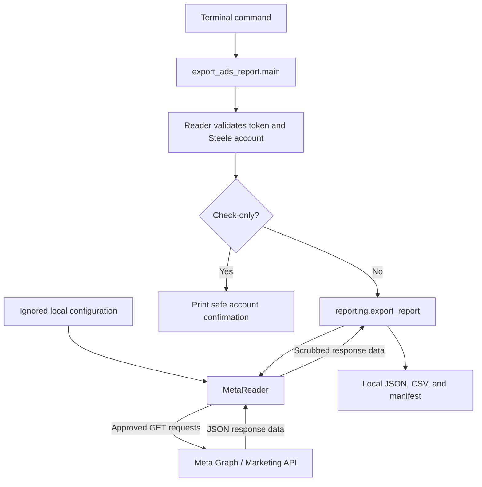

# Meta Ads code learning handoff

**Prepared:** 5 October 2026. **Project:** Steele Product Intelligence / Steele Intel, supported by Creatnet.

This document lets ChatGPT or another AI chatbot explain the new Meta Ads code without knowing our earlier conversations. It describes the source as inspected on this date. It is a learning snapshot, not a current advertising performance report.

## 1. How to use this handoff

Attach this Markdown document first. Markdown is a plain-text document format; a chatbot can read it even if it does not display the diagrams. For detailed code explanations, also attach the source files from `Meta_Ads_Learning_Pack_2026-10-05.zip`. If the chatbot cannot open ZIP archives, extract the archive and attach its files individually. The archive preserves the original repository paths.

The pack contains this handoff, a read-first prompt, selected Python source, the tests, dependency settings, and a source manifest. It excludes credentials, advertising exports, customer records, browser state, and the rest of the repository. It is a study pack, not a runnable copy of the entire project. Keep internal project material within services approved for your work.

### Ready-to-paste prompt

> I am learning the Meta Ads changes in Steele's Product Intelligence discovery project. Read the attached learning handoff first, then the source files if available. Assume I have no prior knowledge of APIs, authentication, reporting, or this codebase. Explain the project purpose and how these changes fit into it. Then walk through a one-day report: what starts it, how credentials and permissions are checked, how data is collected, and how local files are produced. Define technical terms immediately in plain language. Connect important functions and code blocks to their purpose, inputs, outputs, reasons, assumptions, and failure cases. Use the supplied source as evidence; do not invent missing behavior. Distinguish implemented behavior, successful tests, dated live checks, and remaining unknowns. Explain why purchases, reach, missing values, dates, and attribution need careful interpretation. Start with the overall flow and let me ask for deeper detail. Do not default to quizzes. Do not request secrets, run live queries, change advertising assets, or propose production infrastructure as part of teaching this code. If attachments are missing or inaccessible, say which claims you can explain from this handoff and which need the actual source.

## 2. Project background: what we are trying to learn

Steele is the business whose ecommerce and advertising data we are studying. Product Intelligence means using that data to support decisions about products, marketing, sales, and inventory.

Three sources describe different parts of the business:

| Source | What it describes | Why it matters |
| --- | --- | --- |
| Shopify | Products, orders, payments, refunds, and current commercial order state | Establishes what was sold and the business's financial records |
| Google Analytics 4 (GA4) | Captured website visits, events, and purchases | Helps explain website behavior and recorded marketing journeys |
| Meta Ads | Campaigns, ads, creative content, spending, delivery, and Meta-attributed results | Helps explain paid advertising and the results Meta credits to it |

An **API**, or application programming interface, lets our Python code request selected information from another system. Here it lets us read Meta's advertising data without manually exporting each table from Ads Manager.

This repository, `product-intelligence-discovery`, is a **discovery repository**: small research programs used to check access, inspect fields, export bounded samples, and test data relationships. It uses Python 3.12 and `uv`, a tool that manages the project's Python environment and dependencies. A dependency is another software library our code uses.

The chosen direction is to use **Dalgo**, Project Tech4Dev's data platform, for aggregation and the database foundation. The project handoff describes Creatnet's intended work around missing connectors, analysis, dashboards, and later intelligence features. Exact connector coverage, hosting, contractual responsibilities, and delivery details still need confirmation. The earlier custom database roadmap is historical.

These Meta changes create a local discovery reader. They do not add a database, scheduled ingestion, dashboard, deployment, or production Dalgo connector. A connector is the integration that repeatedly brings source data into a destination system; deciding whether Dalgo needs a custom one comes after understanding Steele's actual source data.

### What we already know, and the next dependency

Earlier research found a useful Shopify–GA4 matching foundation for **1–7 July 2026**: 207 captured GA4 transaction IDs matched saved Shopify order IDs, and 326 transaction–variant combinations matched product identity and original purchased quantity. A variant is a particular product option, such as a size.

The referenced prior chat, **Explore Dalgo repos for PI work**, reported fresh GA4 checks on **1 October** against saved Shopify data. Shopify's refresh returned HTTP 401, an access rejection. The sample had 206 of 231 Online Store orders captured in GA4; the cause of the missing 25 remained unknown. These are dated sample findings, not universal guarantees or checks rerun for this document.

The next sequence is:

1. Establish read-only Meta access and understand available data. This code supports that step.
2. Inspect destination links and **UTM parameters**, tracking labels in website URLs, to see what campaign/ad identifiers actually survive into GA4 and Shopify.
3. Investigate both `Meta → GA4 → Shopify` and `Meta → Shopify` relationships.
4. Choose **attribution rules**, the rules for giving marketing interactions credit for a sale, after observing the available evidence.

The new reader does not implement these cross-source relationships. Meta's purchase count alone cannot identify individual Shopify orders.

## 3. What changed, and why

Before this change, the repository had early Meta connection, listing, creative, and Facebook Page/object-story experiments. Some saved lists were first-page samples. The older authorization flow involved Page permissions and a Page token, and some creative-content requests failed. That investigation did not establish a complete advertising performance report.

The new path provides an explicit advertising-only report command, with separate responsibilities for validating access, making approved reads, and saving interpretable local evidence. The older experiments remain separate.

For example, asking for **1 September 2026** now means: validate the specified Steele account; collect current campaign/ad-set/ad inventory; request daily performance for that date; inspect creatives associated with the reporting ads; save data and a record of its settings and limitations. A failed run is identified as failed rather than being presented as a full result.

No new libraries were added. The code uses existing `requests` for HTTP calls and `python-dotenv` for local configuration, plus Python's built-in libraries for dates, CSV, JSON, hashing, and tests. HTTP is the protocol used to exchange requests and responses over the web.

## 4. Architecture: three main parts

**Architecture** means how responsibilities are divided and how the parts communicate.

| File | Responsibility | Important blocks |
| --- | --- | --- |
| `scripts/meta/export_ads_report.py` | Starts the process from a terminal command | `main()` reads arguments, checks dates, validates access, and chooses check-only or export |
| `meta_discovery/reader.py` | Controls every Meta request | `ReaderConfig`, `validate()`, `_request()`, `pages()`, `objects()`, `insights()`, `report_creatives()`, `scrub()` |
| `meta_discovery/reporting.py` | Organizes reads and writes local evidence | `export_report()`, `windows()`, `flatten()`, `action_rows()`, `totals()`, JSON/CSV writers |
| `tests/test_meta_reader.py` | Checks behavior using fake API responses | 23 offline tests for restrictions, paging, interpretation, and export success/failure |
| `meta_discovery/auth.py` | Existing configuration helper | New reader imports only `CONFIG_FILE`; it does not use the legacy token-loading functions |

The command decides **what to run**. The reader decides **what can be requested**. The reporting code decides **how to arrange and save the results**. Keeping these separate makes the safety checks reusable and lets tests replace Meta with fake responses.



In words: the command loads configuration into a reader and validates access. For an export, the reporting function asks that reader for inventory, daily performance, and selected creatives. Only the reader contacts Meta. The reporting function saves the returned information locally.

## 5. Follow a one-day run step by step

### Step 1: choose dates and load configuration

`main()` accepts `--since`, `--until`, and `--check-only`. Dates are inclusive: using the same start and end requests one day. The command permits 1–31 days. Its defaults are **1–30 September 2026**, not a rolling recent-month range.

`ReaderConfig.from_file()` reads ignored `config/meta/.env` directly. It requires these names; the pack contains no values for the secret entries:

| Setting | Meaning |
| --- | --- |
| `META_USER_ACCESS_TOKEN` | A credential granting the app the user's approved advertising access |
| `META_APP_SECRET` | The app's confidential credential, used for token checks and request proof |
| `META_AD_ACCOUNT_ID` | Must identify Steele account `2313037395632947` |
| `META_APP_ID` | Must identify app `2262542241238863` |
| `META_GRAPH_API_VERSION` | Optional; defaults to `v26.0`; the code allows `v25.0` or `v26.0` |

Configuration cannot silently select another app/account. It also does not fall back to the older `META_ACCESS_TOKEN` or take ordinary shell-variable overrides for these required values. Secret fields are excluded from the configuration object's standard printed representation.

### Step 2: validate access before requesting advertising data

`MetaReader.validate()` calls Meta's `debug_token` endpoint. An endpoint is a specific API address for a particular operation.

It checks that the token is valid, belongs to the expected app, is a user token, includes `ads_read`, has no permissions beyond `ads_read` and optional `public_profile`, and has not passed a supplied token/data-access expiry. `ads_read` is the permission for advertising reads. A token with broader permissions is rejected by this reader, even if it could otherwise work.

It then reads `act_2313037395632947` and requires the expected account ID, currency, and time zone. `act_` is Meta's prefix for an ad-account API path. Failure resets the reader's validated state and stops the command. Check-only stops after successful validation and creates no report folder.

An app dashboard label such as “Create & manage ads with Marketing API” is not proof that this token has management access. The token's actual permissions are what the validation checks.

### Step 3: collect current inventory across all pages

`export_report()` creates a new timestamped folder with a short random suffix. It first writes a `running` manifest. A **manifest** is a small JSON document recording what was collected, with which settings, and whether the process finished.

It asks `objects()` for campaigns, ad sets, and ads:

- A **campaign** groups advertising around an objective.
- An **ad set** groups ads with shared delivery settings. Its `attribution_spec` records available attribution settings.
- An **ad** connects its campaign/ad set to a creative.
- A **creative** is advertising content and related destination/tracking information.

`pages()` handles **pagination**, where Meta divides a long list into several responses. It requests up to 500 rows per page and continues while Meta signals more data. It takes only the `after` cursor, a continuation marker, and rebuilds the same approved request. It does not follow the supplied `paging.next` URL. Missing or repeated continuation markers stop the run as incomplete.

The returned pages contain data only. Campaigns, ad sets, and ads are saved as JSON and CSV. JSON preserves nested structures; CSV provides rows and columns useful for inspecting data in a spreadsheet. Reading ads also builds an in-memory mapping from ad IDs to creative IDs.

### Step 4: collect daily advertising performance

`windows()` divides the chosen dates into inclusive chunks of at most seven days. September becomes 1–7, 8–14, 15–21, 22–28, and 29–30. This keeps GET reporting requests bounded without creating a background report through POST.

`insights()` requests `/act_2313037395632947/insights` with explicit fields, `level=ad`, and `time_increment=1`. An **Insights report** is Meta's performance data; one returned row represents one ad on one account-local calendar day with reported delivery. This is not an order table or a list of individual customers. Missing days do not produce synthetic zero rows.

The report includes IDs/names, spend, impressions, reach, clicks, link clicks, action counts, action values, and website purchase ROAS. **Impressions** count displayed ads. **Reach** measures distinct people reached. **ROAS**, return on ad spend, is a ratio of attributed revenue to advertising spend.

The exporter checks each row's account, currency, one-day date shape, requested date range, and unique `(ad_id, date_start)` pair. Unexpected or duplicate rows stop the export. Rows are stored in memory across windows, then sorted for the final CSV; this is intended for small discovery windows, not unlimited history.

### Step 5: read creatives relevant to the report

`report_creatives()` starts with IDs from the performance rows, intersects them with the ads found in the current inventory, and requests each distinct referenced creative. It avoids reading the whole creative library and avoids duplicate reads when several ads share a creative.

Requested fields include names, text, destination links, `url_tags`, and available structured content. `url_tags` may contain tracking labels; collection does not prove that those labels are populated or suitable for linking sources.

If detailed fields produce Meta error 100 or 200, the reader tries only `id,name` and records the limitation. If those basic fields are also unavailable with those errors, it records that and continues. Other fatal errors stop the run. It never requests wider permissions. Missing inventory ads or missing creative IDs are recorded explicitly.

This inventory describes objects available **at collection time**. It does not reconstruct what each creative looked like on a historical reporting day.

### Step 6: finish files and declare status

The exporter writes the final daily table, the separated action table, and settings/counts/limitations in the manifest. It sets `complete` only after those export stages finish. Handled exceptions or interruption mark it `failed` and preserve completed partial files. A final manifest records collection finish time and request usage.

A process force-killed or a disk failure can prevent that final update; a manifest still marked `running` is not a completed report. Rerunning creates a new folder; there is no resume-from-checkpoint mechanism.

## 6. How advertising changes are blocked

`_request()` is the central request boundary. It accepts only GET, the HTTP method used here to retrieve information. POST and DELETE are blocked before making a network call. The reader also restricts the API origin, account paths, fields, and query parameters. Individual creative paths become eligible only through creative IDs collected from this account's ads. It does not allow arbitrary URLs, field expansion, method overrides, or event-submission endpoints.

The token is sent in the Authorization header. Advertising requests include `appsecret_proof`, an HMAC-SHA256 signature calculated from the token and app secret. A signature is a derived value that demonstrates knowledge of the secret without sending that secret as a normal advertising parameter. Token validation uses app credentials separately.

Requests have a 30-second timeout and do not follow redirects. `scrub()` removes credential keys and redacts token, secret, proof, and credential-bearing query values in returned/exported information. Errors expose safe explanations and codes instead of raw response bodies or request URLs.

Transient failures allow at most three attempts with short delays. If Meta provides a recovery estimate longer than the short retry allowance, the code stops instead of repeatedly calling the API. It retains only selected numeric usage values.

These are safeguards in this implementation, backed by offline tests. They are not a guarantee about arbitrary future code edits. Do not replace this path with an unrestricted request helper while teaching or extending it. The intended scope remains read and analyze only: never manage advertising assets or submit conversion events.

## 7. How to interpret the saved data

| Interpretation | What the code preserves | Why it matters |
| --- | --- | --- |
| Date | Account-local daily dates; observed account zone was Australia/Sydney | Your Mac's time zone does not determine the report boundaries |
| Currency | Account and row currency; observed currency was AUD | Amounts cannot be compared safely without matching currency |
| Attribution | `use_unified_attribution_setting=true`, plus available ad-set settings | Conversion credit follows the ad sets' rules |
| Conversion reporting date | `action_report_time=impression` | Credited conversions can appear on the impression date rather than the purchase date |
| Missing value | Absent/null in JSON, blank in CSV, missing-field counts | Missing is not automatically zero |
| Actions | Source field, action type, metric, and value remain distinct | `purchase`, `omni_purchase`, and website purchase types may overlap |
| Reach | Retained per row; no overall sum | The same person can appear across ads or days |
| Totals | Only spend, impressions, clicks, and link clicks are added | ROAS, reach, and overlapping action types are not additive totals |
| Inventory | Current accessible objects under Meta's default status coverage | Complete pagination does not establish access to every historical/deleted object |

`action_rows()` turns nested action structures into a separate table without merging the types. `totals()` uses `Decimal`, Python's decimal arithmetic type, and records how many rows had or lacked each additive metric. If no rows contain a metric, its sum is null rather than an invented zero.

For an **illustrative, invented example**, one ad might report both `purchase: 2` and `omni_purchase: 2`. Adding them to make four purchases could double-count the same results. A `website_purchase_roas` value of 3 is a ratio, not A$3. The exporter preserves those distinctions; it does not settle business definitions for us.

### Output files

All new report files go under `outputs/meta_discovery/reports/<unique-run>/`.

| File | Contents |
| --- | --- |
| `manifest.json` | Status, account, safe token-validation metadata, dates, attribution, collection times, counts, missing fields, caveats, and usage estimates |
| `campaigns.json` / `.csv` | Current accessible campaigns |
| `adsets.json` / `.csv` | Current accessible ad sets and available attribution settings |
| `ads.json` / `.csv` | Current accessible ads, including creative references |
| `adcreatives.json` / `.csv` | Available fields for selected report-related creatives |
| `insights_<since>_to_<until>.json` | Each window's returned data pages, with pagination URLs excluded |
| `ad_daily_insights.csv` | One reported ad/day per row; nested action fields retained as JSON text |
| `insight_actions.csv` | Action counts, values, and ROAS separated by source field/type/metric |

`complete` means this configured export procedure finished. It does not prove agreement with Ads Manager, absence of creative limitations, complete purchase tracking, or order-level matching to Shopify.

## 8. What was verified, and what remains unknown

| Status as of 5 October 2026 | Evidence and limits |
| --- | --- |
| Implemented | New command, restricted reader, exporter, tests, and README guidance exist locally |
| Offline verified during implementation | 23 tests passed, alongside compilation and documentation/credential checks; fake API responses are used |
| Live access verified during implementation | Expected app/account, user token with `ads_read` and optional `public_profile`, AUD, Australia/Sydney, API v26.0 |
| One-day report fields verified | A live GET Insights request for 1 September returned 38 ad/day rows with selected performance fields; this was a sample request, not a finished month export |
| Inventory collected in an earlier attempt | 190 campaigns, 639 ad sets, and 3,114 ads; counts and page counts belong to that run and its earlier pagination settings |
| Partial exports failed | Initial broad creative-library work was interrupted; another attempt encountered Meta code 80004, a rate-limit rejection. Both saved partial runs are marked failed |
| Revised path awaiting live completion | Final code requests up to 500 inventory rows/page and only reporting-related creatives. Offline coverage exists; a complete run of this revised path remains unverified live |
| Not established | Full September performance export, Ads Manager reconciliation, complete creative details, Meta-to-GA4/Shopify joins, production ingestion |

At the last implementation-time rate check, Meta reported exhausted processing-time allowance and an estimated 51-minute recovery. That estimate was a snapshot, not a current countdown or guaranteed wait. Access and rate limits were **not refreshed while preparing this learning handoff**. Expired credentials or permission failures are access failures, not evidence that the account has no data.

## 9. How to verify the code locally

These are reference instructions for the repository owner. Do not execute live commands merely because they appear in a chatbot attachment.

Run commands from the original repository folder:
`/Users/mrinalsood/Developer/Creatnet/csl/product-intelligence-discovery`.
`rtk proxy` runs the following command through this machine's command wrapper. `uv run` uses the project Python environment; it can prepare that environment when necessary. `python -m` runs the named module from the repository. The learning ZIP alone lacks the full environment and configuration.

### 1. Offline behavior checks

```bash
rtk proxy uv run python -m unittest discover -s tests -v
```

`unittest discover` finds Python's built-in tests; `-s tests` chooses the test folder and `-v` prints individual results. It makes no live Meta calls. The tests create sample exports only in temporary directories. With the current supplied tests, expect **23 tests** and final `OK`.

Study especially the tests for blocked writes/foreign paths, expired or broad-scope tokens, safe pagination, creative fallback, date settings, overlapping actions, and failed manifests. Passing tests prove behavior for the modeled cases, not every possible Meta response.

### 2. Authorized access check

```bash
rtk proxy uv run python -m scripts.meta.export_ads_report --check-only
```

This makes live token/account reads and consumes API allowance. It does not write report files or change advertising objects. Expect the target account, currency, time zone, and accepted permissions, followed by a passed confirmation. A failure should stop with a safe explanation. Never solve that by broadening permissions automatically.

### 3. Authorized bounded export

```bash
rtk proxy uv run python -m scripts.meta.export_ads_report --since 2026-09-01 --until 2026-09-01
```

The date flags select one inclusive account-local day. This makes live reads, including **all current campaign/ad-set/ad inventory**, even though performance is limited to one day. It consumes allowance and writes a new local report folder. Expect progress, then a complete folder path and row counts if it succeeds. Check `manifest.json` for `status=complete`, dates/settings, missing fields, creative limitations, and counts before treating it as a completed report. A failed run remains partial evidence.

The next external comparison should use Ads Manager with aligned account, dates, status filters, attribution settings, conversion reporting date, and metric definitions. Do not assume Meta totals equal Shopify sales.

## 10. Questions for the receiving chatbot

Use these when I ask for deeper explanations, rather than presenting all topics at once:

1. Walk through `main()` for a one-day run. What changes when `--check-only` is present?
2. Why are `ReaderConfig`, token validation, and account validation separate checks?
3. Explain `_request()` in blocks: request restrictions, credentials, response parsing, usage estimates, retries, and safe errors.
4. Show how `pages()` continues a list without following `paging.next`.
5. Trace one ad ID from inventory to daily insights and its selected creative. What happens if it is missing from current inventory?
6. Explain why `windows()`, row validation, and duplicate detection are needed even after a successful API response.
7. Explain `action_rows()` and `totals()` with invented examples, preserving missing values and overlapping action types.
8. What makes a run complete or failed, and what does neither status prove about business data?
9. What evidence would we need before linking a Meta ad to a GA4 purchase or Shopify order?

## 11. Source provenance and reading order

**Repository base commit:** `24035d586dc0b252e3c07f2e7acf035b219c815a`. A commit is a saved Git revision. The new reader, exporter, command, and tests were **uncommitted local additions** at packaging time, so that commit alone does not contain them. README and the historical project handoff also had local changes. Those changes and other existing work were preserved.

The ZIP's `SOURCE_MANIFEST.json` lists original paths, sizes, SHA-256 hashes, roles, and Git state. A hash is a fingerprint for checking that a file matches the packaged snapshot. The manifest makes the exact teaching source identifiable even though it is not committed.

Suggested source reading order:

1. `scripts/meta/export_ads_report.py` — see the entry point and date choices.
2. `meta_discovery/reporting.py` — follow the overall collection/export sequence.
3. `meta_discovery/reader.py` — study the access checks and request boundary.
4. `tests/test_meta_reader.py` — inspect concrete expected behaviors and failures.
5. `meta_discovery/auth.py` and `pyproject.toml` — understand the reused configuration path and existing libraries.

The two `__init__.py` package markers for `meta_discovery` and `scripts/meta` are included for context. No installation or execution is required to study the pack. The current wheel build configuration lists Shopify and GA4 packages; do not infer that this snapshot is an independently installable Meta package.

Project context was checked against the repository README, the dated project handoff and its 5 October Meta update, the relevant source/tests, and the referenced prior chat. This document incorporates the October code and tests; older prose saying there was no automated test suite or no Meta performance sample describes the earlier repository state. For future implementation work, reread current source and local agent instructions rather than treating this dated learning document as permanent authorization.
